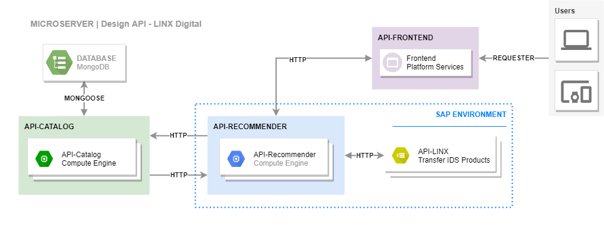
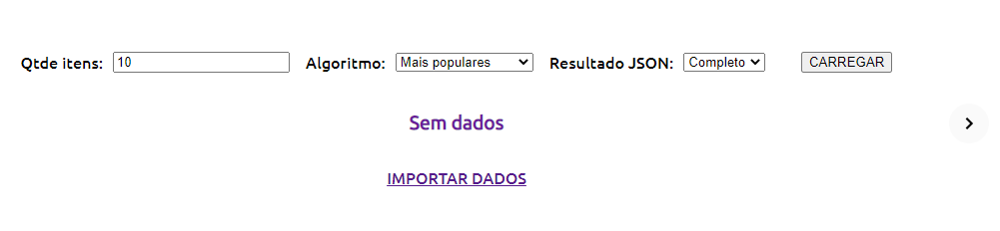
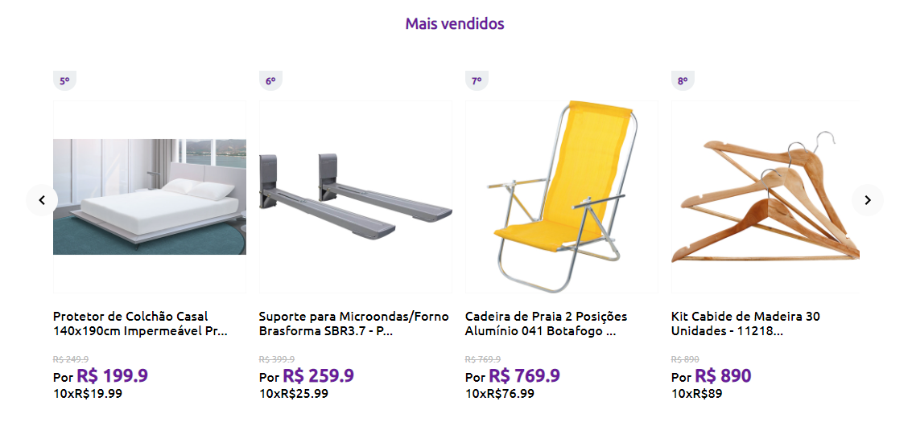
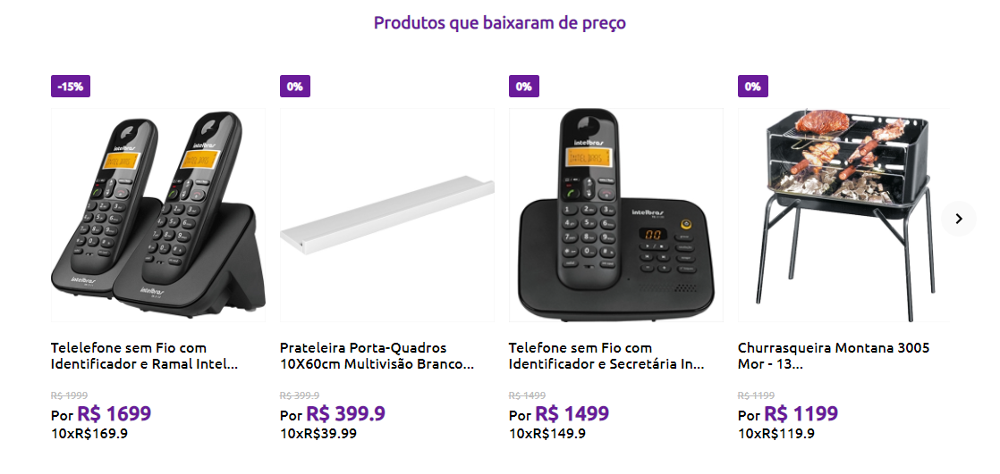

# **DESAFIO LINX Digital | Desenvolvedor FullStack**

O desafio visa avaliar a capacidade de implementação de um sistema contendo mais de uma camada, duas em backend e uma frontend. A aplicação a ser desenvolvida, é um sistema para exibir vitrines de recomendação em um site, essas camadas são: 1. **API Catálogo**; 2. **API Recomendação**; e **3. API FrontEnd**. O Projeto deve seguir as seguintes diretrizes.

### **ESPECIFICAÇÕES GERAIS**
- *Queremos avaliar aquilo que você conseguir produzir do desafio, então mesmo que você não consiga desenvolver tudo, envie o resultado para que possamos analisar;* e
- *Procure desenvolver primeiro os itens obrigatórios e fechar o escopo do projeto, e só então partir para os opcionais.*

### **PONTOS AVALIADOS**
- [x] *Funcionamento do sistema;*
- [x] *Utilização de boas práticas na definição das rotas e parâmetros da api;*
- [x] *Organização do projeto e estilo de código;*
- [x] *Boas práticas de qualidade e performance do HTML e CSS;*
- [x] *Otimização do projeto frontend;* e
- [x] *Tecnologias/ferramentas utilizadas no desenvolvimento do projeto.*

---

## **TECNOLOGIAS**

As tecnologias aplicadas para o desenvolvimento deste desafio, foram:

| Descrição | Versão |          |
|-----------|--------|----------|
| Node JS   |v12.16.1 | [Leia +](https://nodejs.org/en/)    |
| Mongo DB  |v4.2 | [Leia +](https://www.mongodb.com/)  |
| Postman  |v7.28.0 | [Leia +](https://www.postman.com/)  |

Tenha todas essas ferramentas instaladas em seu computador para os teste.

## **RESOLUÇÃO**

#### **MICROARQUITETURA DE COMUNICAÇÃO**

A imagem seguinte apresenta, de forma simples, o padrão de comunicação entre as APIs propostas no desafio. Primeiro recebe-se uma entrada do usuário, essa requisição é feita no *clientserver*, neste caso API-FrontEnd, em seguinda esse serviço dispara uma chamada a segunda camada, a API-Recommender que por sua vez abre uma conexão com uma API externa disponibilizada pela Linx. O retorno desta comunicação resulta em uma lista de ID, esses dados são encaminhados para a camada 3, a API-Catalog. Quando essa é requisitada abre-se o processo de importação dos dados, conectando à base de dados MongoDB, feito isso, o retorno é imediato e entregue camada-a-camada até que chegue ao usuário em forma de carousel. Segue imagem.



#### **SERVIÇOS POR API**

- **API-CATALOG**

    Está API é responsável por importar dos dados do catalog.JSON e devolver os dados de acordo com a chamada da camada posterior. Os EndPoints são:

  - **/catalog/import-data** -> ao executa o método de importação dos dados, a API interpreta o arquivo 'catalog.json', salvo no diretório *craw_data* na raíz da API, e envia os dados para o MongoDB Cloud;
  - **/catalog/get-by-id?id=X,Y,Z&status=<AVAILABLE>&format=<complete|compact>** -> neste, temos o endpoint que consulta à base dados e retorna todas as informações solicitadas, para isso, estes parâmetros são necessários: a) *id*, com todos os valores de identificação dos itens requisitados separados por vírgula; b) o status do objeto; e c) formato do resultado, podendo ser completo ou compactado.

- **API -RECOMMENDER**

    Essa API é responsável pelo middleware de dados requeridos do *client*. É nela que definimos o tipo de dados que iremos retornar, se serão dados com os produtos mais vendidos ou com produtos em oferta. Há apenas um endpoint com três parâmetros distintos. Veja.

    - **/recommender/items/?max=x&alg=<1|2>&scope=<complete|compact>** -> o primeiro parâmetro é para indicar a quantidade de itens que serão retornados para interface; o segundo, é para indicar qual dos algoritmos de recomendação será usado: a) com produtos mais populares; e b) com produtos com redução de preço.

- **API -FRONTEND**

    Aqui, ao iniciar o servidor, teremos uma primeira tela conforme, imagem.

    

    Os *inputs* são para facilitar o teste. O primeiro item do formulário trata-se da quantidade de resultados carregados em tela. O próximo é direcionado ao algoritmo de recomendação. Por fim, indicamos o formato das instâncias. Uma vez feito isso, ao clicar em CARREGAR, os dados são apresentados. Conforme imagens.

    
    

## **COMPILANDO O PROJETO**

  O projeto foi desenvolvido completamente em **NodeJS**, isso facilita sua execução. Entretanto, antes de tudo precisamos instalar todas as dependências API-a-API, isso pode ser feito usando o seguinte comando:

  - Calma, não esqueça de acessar o diretório de cada projeto via terminal/cmd.
  ````
  cd /caminho/para/diretorio
  ````
  - Pronto. Agora execute.
  ````
  npm install --save
  ````
  Espere até que tudo seja instalado, uma vez concluído basta executar o comando seguinte para iniciar o projeto.
   ````
  npm start
  ````
  Faça isso para todas as APIs e o projeto funcionará perfeitamente...


## **TESTANDO O PROJETO - ONLINE**

  Caso queira apenas testar e validar as funcionalidades, acesso os links seguintes parar ter acesso a aplicação frontend e as respectivas api's.

  - [Click aqui para iniciar a API-CATALOG](https://catalog-linx.herokuapp.com/)
  - [Click aqui para iniciar a API-RECOMMENDER](https://recommender-linx.herokuapp.com/)
  - [Click aqui para testar a aplicação](https://front-linx.herokuapp.com/)


###### Caso não retorne nenhum dado, experimente clicar [nest link](https://catalog-linx.herokuapp.com/catalog/import-data) para fazer o import dos dados ou pressione o link "Importar Dados" na tela inicial da api frontend, conforme figura 1.

---
Desenvolvidor por [Paulo Moraes](http://pauloigorms.github.io/) com ❤️